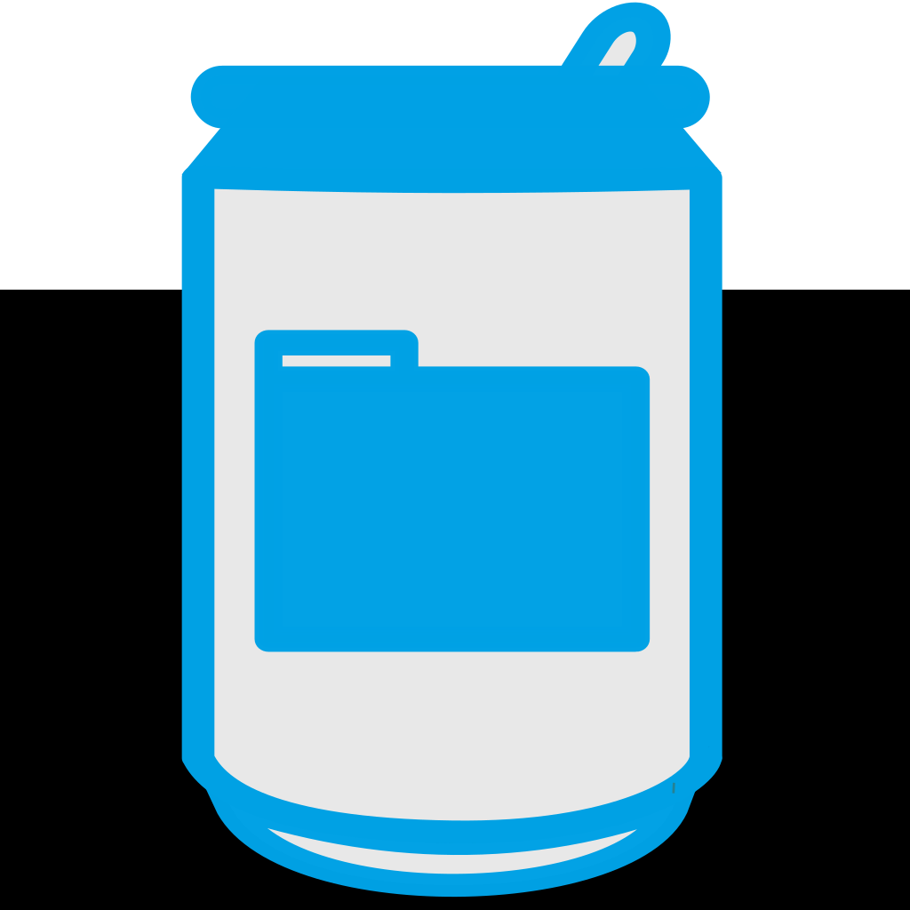

<div align="center">

  
  <h1>SODA for SPARC Documentation</h1>
  
  <p>
    A comprehensive documentation of the SODA for SPARC project!
  </p>

<p>
  <a href="https://github.com/fairdataihub/SODA-for-SPARC-Docs/graphs/contributors">
    
  </a>
  <a href="">
    
  </a>
  <a href="https://github.com/fairdataihub/SODA-for-SPARC-Docs/stargazers">
    
  </a>
  <a href="https://github.com/fairdataihub/SODA-for-SPARC-Docs/issues/">
    
  </a>
  <a href="https://github.com/fairdataihub/SODA-for-SPARC-Docs/blob/main/LICENSE">
    
  </a>
  <a href="https://doi.org/10.5281/zenodo.6407300">
    
  </a>
  <a href="https://fairdataihub.org/fairshare">
    
  </a>
   <a href="https://docs.sodaforsparc.io/">
    
  </a>
  <a href="https://docs.sodaforsparc.io/">
    
  </a>
</p>
   
<h4>
    <a href="https://docs.sodaforsparc.io/docs/intro">What is SODA?</a>
  <span> · </span>
    <a href="https://docs.sodaforsparc.io/">Documentation</a>
  <span> · </span>
    <a href="https://docs.sodaforsparc.io/docs/developer-documentation/changelog">Changelog</a>
  <span> · </span>
    <a href="https://github.com/fairdataihub/SODA-for-SPARC-Docs/issues/">Report Bug</a>
  <span> · </span>
    <a href="https://fairdataihub.org/contact-us">Request Feature</a>
  </h4>
</div>

<br />

# :notebook_with_decorative_cover: Table of Contents

- [:notebook_with_decorative_cover: Table of Contents](#notebook_with_decorative_cover-table-of-contents)
  - [:star2: About the Documentation](#star2-about-the-documentation)
    - [:space_invader: Tech Stack](#space_invader-tech-stack)
    - [:art: Color Reference](#art-color-reference)
    - [:key: Environment Variables](#key-environment-variables)
  - [:toolbox: Getting Started](#toolbox-getting-started)
    - [:bangbang: Prerequisites](#bangbang-prerequisites)
    - [:running: Run Locally](#running-run-locally)
    - [:stopwatch: Versioning](#stopwatch-versioning)
    - [:building_construction: Build locally](#building_construction-build-locally)
    - [:triangular_flag_on_post: Deployment](#triangular_flag_on_post-deployment)
  - [:wave: Contributing](#wave-contributing)
    - [:scroll: Code of Conduct](#scroll-code-of-conduct)
  - [:grey_question: FAQ](#grey_question-faq)
  - [:warning: License](#warning-license)
  - [:handshake: Contact](#handshake-contact)
  - [:gem: Acknowledgements](#gem-acknowledgements)

## :star2: About the Documentation

### :space_invader: Tech Stack

<details>
  <summary>Client</summary>
  <ul>
    <li><a href="https://reactjs.org/">React.js</a></li>
    <li><a href="https://tailwindcss.com/">TailwindCSS</a></li>
  </ul>
</details>

<details>
  <summary>Server</summary>
  <ul>
    <li><a href="https://docusaurus.io/">Docusaurus</a></li>
  </ul>
</details>

### :art: Color Reference

| Color           | Hex                                                              |
| --------------- | ---------------------------------------------------------------- |
| Primary Color   |  #13716D |
| Secondary Color |  #BA0D49 |
| Accent Color    |  #6B7280 |
| Text Color      |  #1C1E21 |

### :key: Environment Variables

To run this project, you will need to add the following environment variables to your `.env.local` file

- None at the moment

## :toolbox: Getting Started

### :bangbang: Prerequisites

This project uses Yarn as package manager

```bash
npm install --global yarn
```

Additionally, a version of Node.js that is >= 14 is required for compatibility with Docusarus.
If your Node.js version is < 14 you can download the latest Node.js version from [the Node.js download page.](https://nodejs.org/en/download/)

### :running: Run Locally

Clone the project

```bash
git clone https://github.com/fairdataihub/SODA-for-SPARC-Docs.git
```

Go to the project directory

```bash
cd SODA-for-SPARC-Docs
```

Install dependencies

```bash
yarn install
```

Start the server

```bash
yarn start
```

### :stopwatch: Versioning

You can use the version script to create a new documentation version based on the latest content in the `docs` directory. That specific set of documentation will then be preserved and accessible even as the documentation in the `docs` directory changes moving forward.

Ideally, you should create a new branch and update the relevant pages. Then send a PR with [@megasanjay](https://github.com/megasanjay) or [@aaronm-2112](https://github.com/aaronm-2112) on the review page.

Only do these steps after all changes to the documentation for the specific version have been completed:

1. Update the docs changelog to be on parity with the changelog in [@SODA-for-SPARC](https://github.com/fairdataihub/SODA-for-SPARC/blob/main/CHANGELOG.md)
2. Make sure the current docs version (the `docs` directory) is ready to be frozen.
3. Update the `version` key in package.json for this repository.

```bash
yarn run docusaurus docs:version 5.3.0
```

This will freeze the current version of the documentation. The files under the current `docs` directory will be considered to be `Upcoming 🚧` version.

### :building_construction: Build locally

Use this step to build a local production version of the site. Use `serve` to preview the local build.

```bash
yarn build
yarn serve
```

### :triangular_flag_on_post: Deployment

You will not need to do anything to the hosted site. Continuous Delivery has been setup with Vercel. All you need to do is push your commit and wait for it to deploy.

## :wave: Contributing

<a href="https://github.com/fairdataihub/SODA-for-SPARC-Docs/graphs/contributors">
  
</a>

Contributions are always welcome!

See [`contributing.md`](https://github.com/fairdataihub/SODA-for-SPARC-Docs/blob/main/CONTRIBUTING.md) for ways to get started.

### :scroll: Code of Conduct

Please read the [Code of Conduct](https://github.com/fairdataihub/SODA-for-SPARC-Docs/blob/master/CODE_OF_CONDUCT.md)

## :grey_question: FAQ

- Can I make changes to previous versions of the documentation?

  - Yes, you can make changes to previous versions of the documentation. You can do this by creating a new branch and adding your changes directly in the `versioned_docs` directory.

## :warning: License

Distributed under the MIT License. See [`LICENSE`](https://github.com/fairdataihub/SODA-for-SPARC-Docs/blob/main/LICENSE) for more information.

## :handshake: Contact

Contact us on Twitter: [@fairdataihub](https://twitter.com/fairdataihub)

Send us an E-mail: info@fairdataihub.org

Project Link: [SODA-for-SPARC](https://github.com/fairdataihub/SODA-for-SPARC)

## :gem: Acknowledgements

A special thank you to Vercel for hosting our application documentation.

<a href="https://vercel.com/?utm_source=fairdataihub&utm_campaign=oss" target="_blank">
  
</a>
