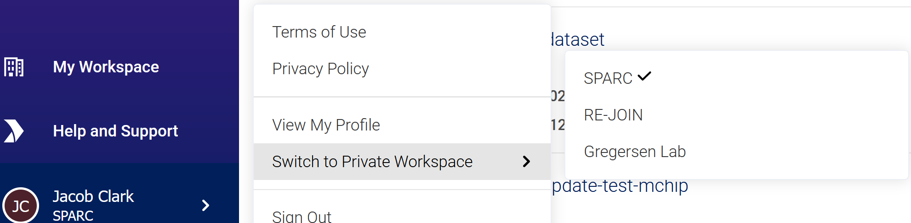

## Background

All SPARC datasets must be submitted through the [Pennsieve Data Platform](https://app.pennsieve.io/) under the Pennsieve workspace you will be uploading your data to (SPARC, RE-JOIN, etc). We explain here how you can get a Pennsieve account and access to your Pennsieve workspace. This is required before you can start adding metadata or uploading your data to Pennsieve through SODA.

## How to

To get Pennsieve account and access to the Pennsieve workspace you would like to upload your data to, simply fill out and submit this [form](https://www.wrike.com/frontend/requestforms/index.html?token=eyJhY2NvdW50SWQiOjMyMDM1ODgsInRhc2tGb3JtSWQiOjUwMzQzN30JNDgwNTg4NjU3MjA3Nwk0MTg5ZTY0ODEyZGYxNTU1ZDJkYmU5MzIxNWZiNTQyZWUwZTMzY2U4NDQ5ODI0ZWI0YzZiMWZhNjVhYzgyOTRm). You should then receive a sign up email once the form is reviewed by the Pennsieve team. If you are a SPARC researcher, we also suggest to request access to the SPARC Airtable sheet through the same form as it will come in handy when your prepare your SPARC metadata files.

Once you have signed up for a Pennsieve account, you should see your workspace listed in your list of available workspaces (see image below).

:::info
If you have any issues, reach out to the Pennsieve team at support@pennsieve.io.
:::

import PageFeedback from '@site/src/components/PageFeedback';

<PageFeedback />
